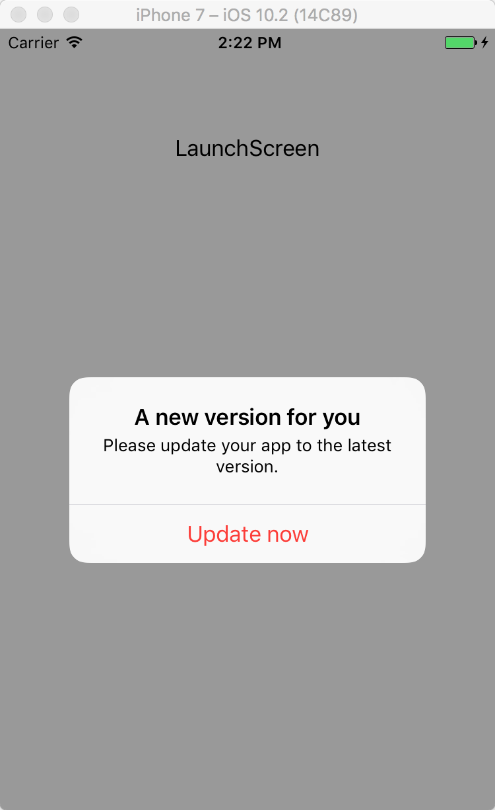
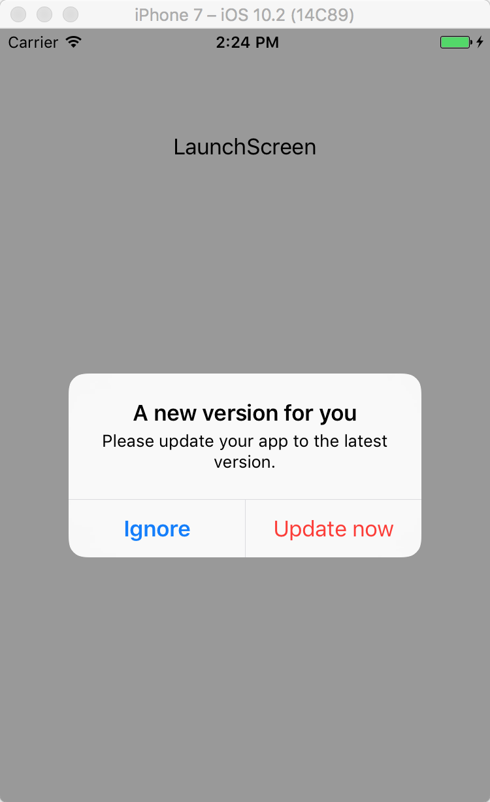

# MJWUpdate
It's a framework for check your app's latest version in App Store, and alert user to update.

## Overview



## Requirements
iOS 8.0+

## Installation

#### CocoaPods
[CocoaPods](https://cocoapods.org/) is a dependency manager for Cocoa projects.

Specify MJWUpdate into your project's `Podfile`:

```ruby
source 'https://github.com/CocoaPods/Specs.git'
platform :ios, '8.0'
use_frameworks!

pod 'MJWUpdate'
```

Then run the following command:

```bash
$ pod install
```

## Usage

Please see the [MJWupdateExample](./Examples/MJWUpdateExample).
